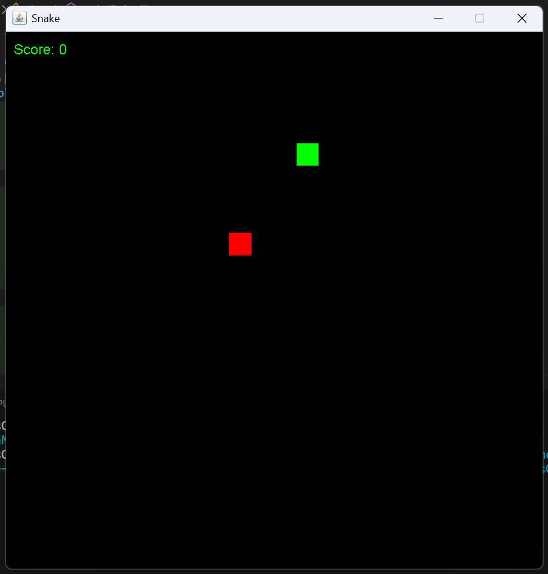
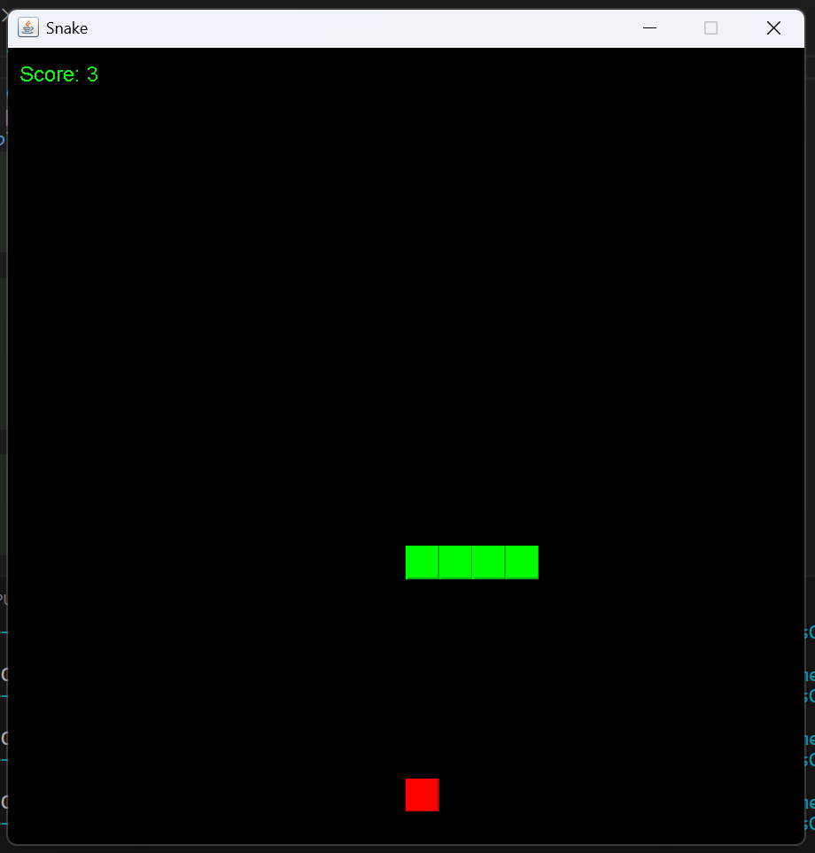
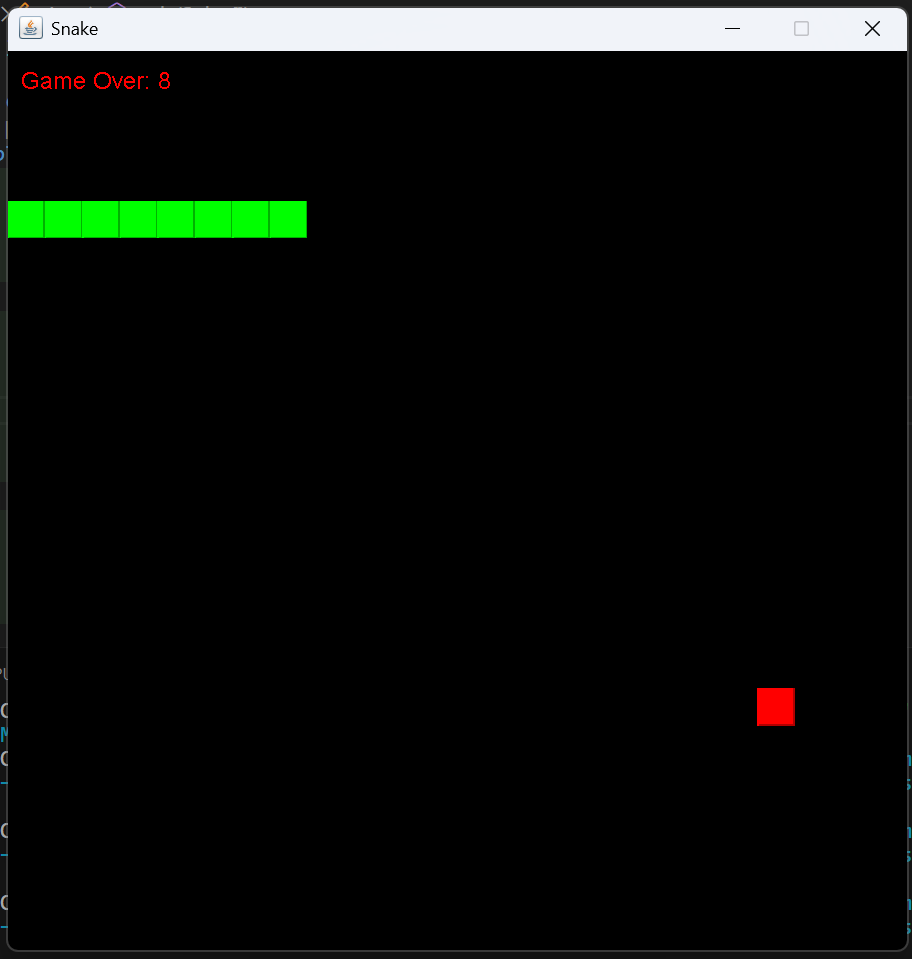

# Snake Game

A classic Snake game built with Java Swing! This project is perfect for learning the fundamentals of game development and object-oriented programming in Java.

## Features

- Interactive gameplay
- Simple and clean UI design
- Scoring system
- Game Over detection

## How to Play

1. Use the **arrow keys** to move the snake (Up, Down, Left, Right).
2. Eat the red food block to grow the snake and increase your score.
3. Avoid hitting the walls or the snake's body. If you do, it's Game Over!

---

## Screenshots

### Game Start



### Gameplay



### Game Over



*(Add these images to a **`screenshots`** folder in your project directory.)*

---

## Getting Started

### Prerequisites

- Java Development Kit (JDK) 8 or higher
- Any IDE (e.g., IntelliJ IDEA, Eclipse) or a text editor and terminal

### Installation

1. Clone the repository:

   ```bash
   git clone https://github.com/yourusername/snake-game.git
   ```

2. Navigate to the project directory:

   ```bash
   cd snake-game
   ```

3. Open the project in your preferred IDE or compile and run it via the terminal.

---

## Running the Game

### Using IDE

1. Open the project in your IDE.
2. Run the `App.java` file.

### Using Terminal

1. Compile the files:
   ```bash
   javac App.java SnakeGame.java
   ```
2. Run the game:
   ```bash
   java App
   ```

---

## Code Overview

### App.java

This file sets up the main JFrame and initializes the SnakeGame panel.

### SnakeGame.java

This is the core logic of the game, handling:

- Game rendering
- Snake movement and collision
- Food placement
- Key inputs for controlling the snake
- Game Over logic

---

## Customization

### Board Size

You can customize the board size by changing the `boardWidth` and `boardHeight` variables in `App.java`:

```java
int boardWidth = 600;  // Change this value
int boardHeight = boardWidth;  // Keep this equal for a square board
```

### Speed

Adjust the game speed by modifying the timer delay in `SnakeGame.java`:

```java
Timer gameLoop = new Timer(150, this);  // Lower value = faster speed
```

---

## Contributing

Contributions are welcome! Feel free to fork the repository, make changes, and submit a pull request.

1. Fork the repository
2. Create a feature branch:
   ```bash
   git checkout -b feature-name
   ```
3. Commit your changes:
   ```bash
   git commit -m "Add your message here"
   ```
4. Push to the branch:
   ```bash
   git push origin feature-name
   ```
5. Open a pull request

---

## License

This project is licensed under the MIT License. See the [LICENSE](LICENSE) file for details.

---

## Acknowledgments

- Inspired by classic Snake games
- Based on tutorials from YouTube and other programming resources

---

Enjoy playing the Snake game! 🐍

